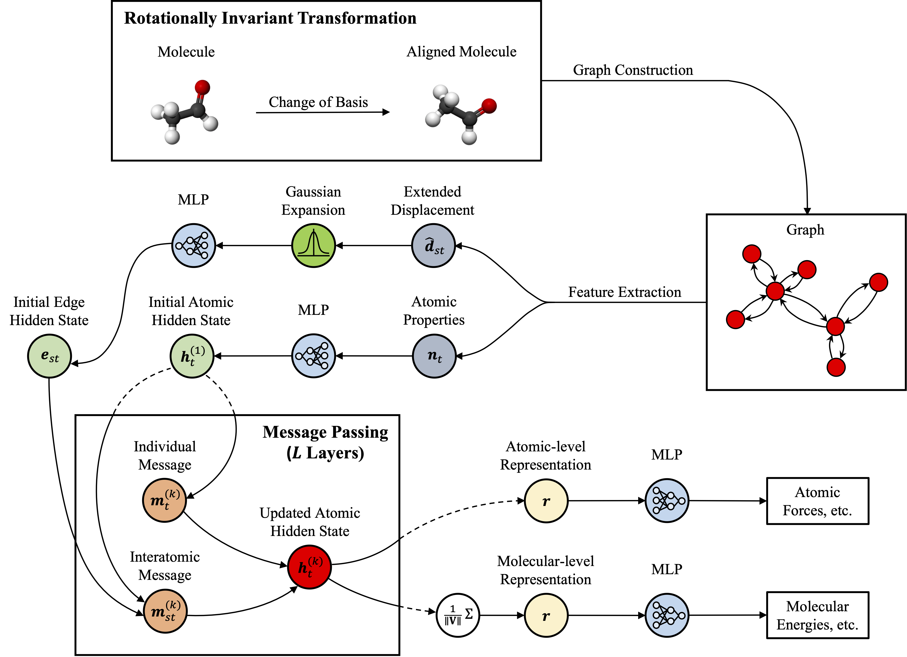

# RotNet: A Rotationally Invariant Graph Neural Network for Quantum Mechanical Calculations



## Datasets

The two datasets used in the experiments can be found at:

- Protein fragments
  - [Google Drive](https://drive.google.com/file/d/1MVoUyM0aX8v3eR5Aahrsk8ySYQ2LrcYd/view?usp=share_link)
  - [百度网盘](https://pan.baidu.com/s/1um5MC3YpqOzfeBtYHlLdJA)（提取码: jymi）
- Electronic materials
  - [Google Drive](https://drive.google.com/file/d/1QD4JF-vOmTBODyUbH1Ko5tXOBLZM9g8l/view?usp=share_link)
  - [百度网盘](https://pan.baidu.com/s/1MdXEFCdq_0qaVuwviIddsw)（提取码：y21t）

Please put the downloaded dataset(s) in `./data/raw`.

## File Hierarchy

- `./data`: Contains datasets used by RotNet.
  - `./data/raw`: *(Needs to be downloaded beforehand. See above.)* Contains our two datasets.
  - `./data/atom_init_embedding.json`: Initial embeddings for atoms.
- `./exp`: *(Will be created automatically on first run.)* Contains training logs and saved model weights.
- `./dataset.py`: Dataset class definition.
- `./evaluate.py`: Evaluates a model. See `./eval.sh` for usage.
- `./loss_weights.py`: Weights for loss terms.
- `./models.py`: Model definition.
- `./train.py`: Trains RotNet. See `./run.sh` for usage.
- `./transforms.py`: Implements the rotationally invariant transformation (RIT).
- `./utils.py`: Helper functions or classes.
- `./eval.sh`: Usage of `./evaluate.sh`.
- `./run.sh`: Usage of `./train.py`.
- `./requirements.txt`: Package specification for environment setup.

## Usage

1. Clone this repository.
2. Set up an environment as per `./requirements.txt`.
3. Download our datasets and put them in `./data/raw`. You may use custom datasets that have been formatted like ours.
4. Process raw data. To process protein fragments, for example, run

   ```shell
   python dataset.py --dataset_name protein_fragments --cutoff 4
   ```

   If you want to overwrite previously processed datasets, run

   ```shell
   python dataset.py --dataset_name protein_fragments --cutoff 5 --remake
   ```

5. *(Optional) Modify weights for loss terms in `./loss_weights.py`.* You will need to modify them if another dataset is in use.
6. Run `./run.sh` to train RotNet. You may modify arguments passed to `./train.py`.
7. Run `./eval.sh` to evaluate models. Arguments passed to `./evaluate.py` must be consistent with those passed to `./train.py`.

## License

Distributed under the Apache 2.0 License. See LICENSE for more information.

## Acknowledgements

This work was supported by the National Key R&D Program of China [No. 2021YFC2100100]; the National Natural Science Foundation of China [No. 21901157] and the Shanghai Science and Technology Project [No. 21JC1403400].
